# Tutorial 1: Create a basic web page layout

In this tutorial you will learn how to create a basic web page desig which we can show off to clinets. It is best to start this tutorial after reviewing the short videos in the [fundamentals](../figma_basic/index.md) section. 

We will cover the following consepts:
- [Creating a basic layout]()
- [Creating a navbar]()
- [Creating buttons]()
- [Adding Images]()
- [Present and share the design]()

> **Note:** *You can use the link to skip to certain sections of this document.*

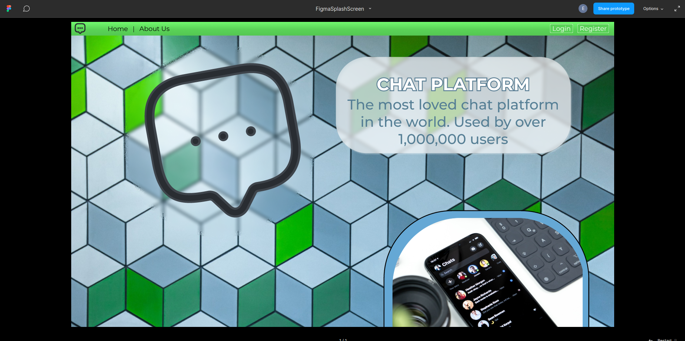

### Creating a basic layout
When you create a design it is important to considder the sise of your canvas. In Figma our canvas is called a `Frame`. A frame defines the basic size of the screen and allows us to present the design as if it is a fully working web page. Once all design elements have been created we can simply move them to the frame. To give us an idea of what our target audince might be using we can google for [the most common screen sizes](https://www.google.com/search?q=most+common+screen+sises&oq=most+common+screen+sises&aqs=chrome..69i57j0i13i512l3j0i22i30l6.5984j0j7&sourceid=chrome&ie=UTF-8). Armed with this information we can now start creating a design.

> **Note:** *At the time of writing this tutorial the mos common screen size was 1920x1080, and is what will be used in this tutorial.*

1. To start we can open a new blank canvas on figma. I'll create a place holder frame for our contnet

Let take a brief moment beofre we get worked up to considder what our web page should liik like. With almost all pages we have some key elements present. We have some form of navigation, some content and links to other web pages like social media or about pages. I went ahead and created a mind map of what our basic web page should look like using [Draw.io](https://app.diagrams.net/). this will give us some clarity on what we shoul considder to be important and what is not as important. 

Armed wtih this knowlege we know we shoul account for at least 3 elements:
- Buttons
- Navbar
- Images - spesifically logo's

we should also account for adidtional pages:
- Login
- Register
- Contact Us

### Creating a navbar

In order to effectivly navigate the through the platfor we need to add a navbar. This does not need to be a complex thing and we will go for a normal option. In our navbar we would like to feature some itmes namely an icon, and a login or register button. Lets start by working on the navbar its self.

1. In Figma select the create rectangle tool or press `R` on your keyboard. Draw out a rectangle in an open area on your work area. 

2. Now resise the rectangle to be the width of your selected screen size and about 50 high. THis should give us a decent sise nav bar to work with.

 

3. Now we can add some color to the navbar. I have decided I want to make my navbar green with a sligh gradient on it. Feel free to copy my design or select your own colors you like.

    We can change the color of the navbar by selecting the `+` icon next to stroke in the design and properties pannel. 

    

    switch to gradient by selecting the gradient logo

    

    we can now select our color we want to use. make sure to do this for both squares. Notice that the opacity of the second square is `0%`. bring this up to `100%` to have two solid colors. Now we can adjust the two colors to what we want. if you want to add more color to the gradient you can do so by double clicking on the squares. 

    

    Notice the gradient follow the gradient line guide on the selected rectangle. This can be adjusted in any angle to create the desired  effect.

    

### Creating buttons
Our nav needs some navigational button be be able to navigate. Lets create some text buttons for the nav. I'll create all the different buttons neede for the navbar. We will need at least the following buttons:

- Home
- Contact us
- Login
- Register

This task can be easily achieved with [varients](../figma_basic/variants.md). 

Use the text tool to create a text box. Type `Home` and hit enter. Now select the text and add an [auto layout](../figma_basic/autoLayout.md). 

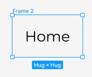

Notice that when we created the auto layout the text was framed. We can nouw give the frame a desctiptave name like `navNormalHome`. This will save us alot of time when we start prototyping. Now copy and paste the frame to create another button. Call this frame something else like `navHomeHover`. 

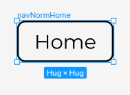

Now we can continue with styling. I'll make the stroke from the first button invisible by setting its opacity to `0%`. Now create a fill and make sure the opacity is set to `0%`. This might look weird now but will make more scense later. 

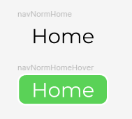

> **Note:***To avoid weird animations when implementing the hover state both button should be identical with the exception of color. If you do not want a fill on the button simply make the opacity 0%*

For the second hover state button well add a stroke and a fill. This can be any color you want as this will be the way you want the button to look when the mouse is hovered over it. 

We need to create components to be able to create varients. To do this select one of the frames and press `ctrl + alt + K` on your keyboard. If the frame turns purple you have done it right. you can also right click and select create component. Now do the same for the other frame. You should be left with somehthing that looks like this:

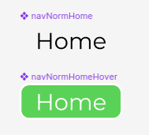

Once both frame have been made into components we can select both of them and in the design and properties menu select combine as variants. 

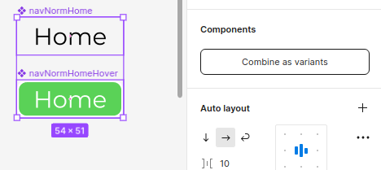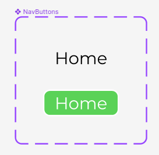

Now we can simply add a new varient by hovring ovr the appropriate button and clicking on the `+` icon. Look fo the add varient tooltip.

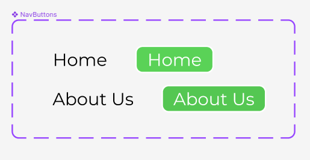

#### Using the buttons
Now that we have created a component set we can use the button in the following way. Select assets from the layers and assets pannel. Now search for your component. In this case I named it `NavButtons`.

Click and drag the component to the working area. The button should say home. From the design and properties menu we can change which varinet we want to use. There are 4 states of this one button and we can easily create more if needed. 

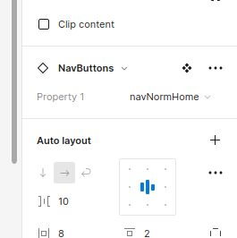

Notice when changing the parent button the chiled button also changed. This is a useful feature if designs throughout many pages needs to be changed.

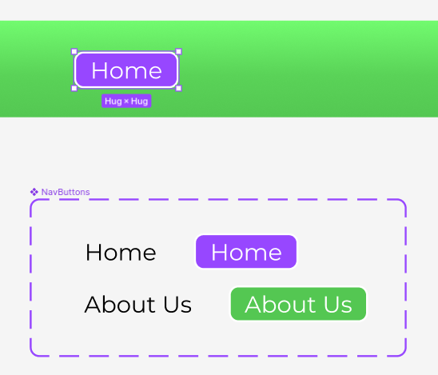

Drag out another button and start to create the layout you would like to see. Add additional atrifacts to make it look nice.

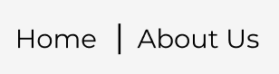

 I want to add a logo to this design. We can easily add an image or `SVG`if you have one on hand. For this demo I will simply use a plugin to get a suitable icon. Plugins can be used by selecting the resources button from the toolbar or pressing `ctrl + I` on your keayboard.

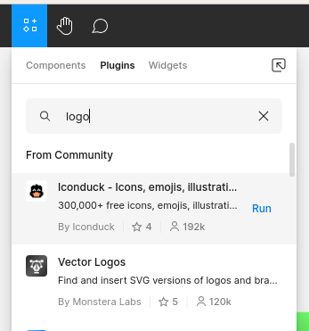

Search for a suitable plugin and select `RUN` from the menu. In most plugin we can siply search for what we want and drag it to the work area.

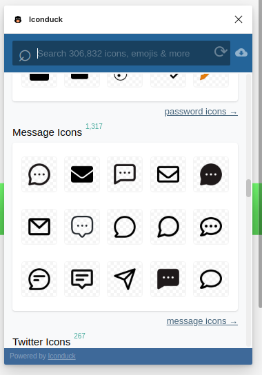

Once all the nessacerry buttons and components have been created we can simply select the entire navbar and create a component. This will like the buttons allow us to use it multiple time on many different pages.

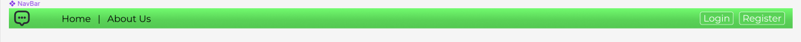

### Adding images
Images can be used to create striking desings in your desing and we can create cool animations using frames with images inside of them. For now lest add some conent to our page and get it looking better.

I started by using the `UNSLPASH` plugin to find some `FREE-To-Use` sample pictures. 

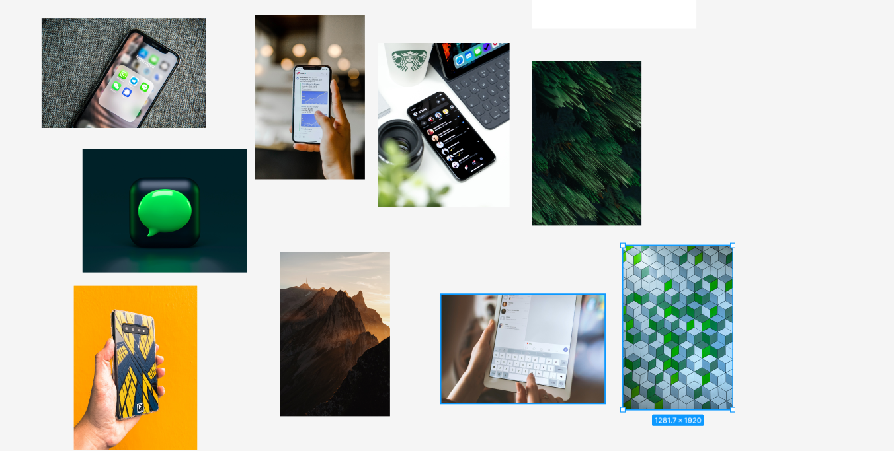

From the selection I decide the colorfull squares should be the background of my design. The only problem is the frame is much larger than the image. This can be quicly fixed by resizing the image while holding down the `shift` button. This keeps the origional aspwct ration of the image while scaling it. 

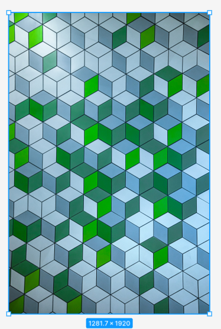
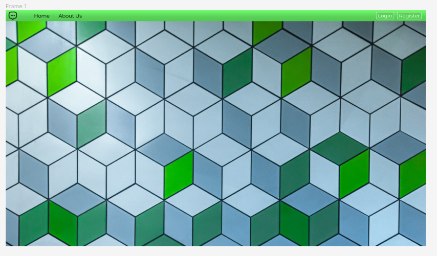

I then went on to create some content for the platform. Using the shape tool to create shapes and adding effects like background blur and drop shadows I created little content blocks. I filled these block with some inspiring words to make it look like a real business website. Not Shakesphere but it will do. I took the logo we added earlier and made a copy which I scaled much larger than the origional size and added that to the design. At this point I did a quick test fit inside the frame to see that everything fits nicely.

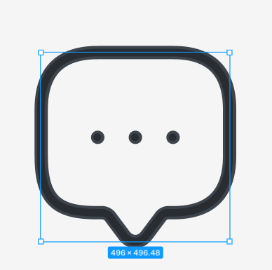

> **Note:***Work outside of the frame taking care to ensure the design works and the layout is functional. Dont be afraid to extend the design way past the sise of the frame.*

Keep on adding shapes to the design and use masks, unions to make new and interesting shapes. A frame is also just a shape. I added a frame and made the corners round then dropped one of the images into the frame to create another content block with an image. Its important to enable the clip contnet checkbox from the design and properties pannel so that content does not overflow. 

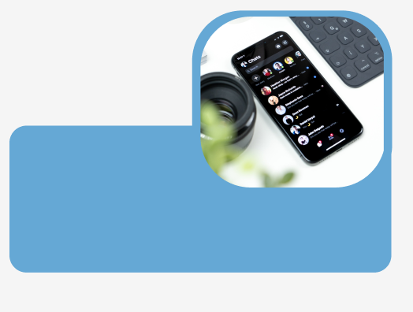

I layered two more squares and with images and some text to create the final content block for the main page of the platform.

After taking the time to fill all content blocks with some text I worked on the layout of the platform. I took time to make sure everything fits and looks aligned.

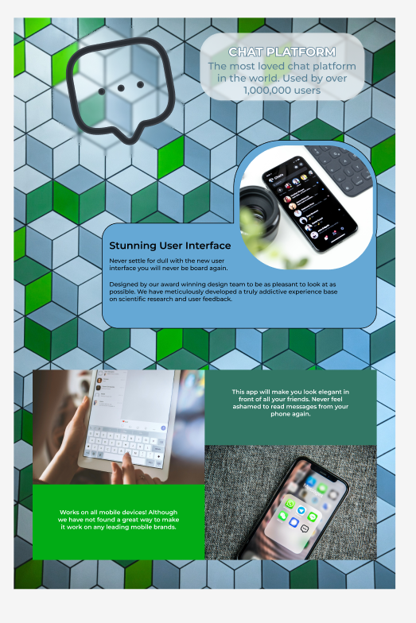

Once I was happy with the layout I selected all the content and dropped it into the frame we made. Notice what happens when you add the desing to the frame. all the content just dissapears behing the frame and wont be visible when we try to present the design. To fix this we need to enable scrolling. This can be done by selecting the frame and then selecting prototype from the design and properties pannel. 

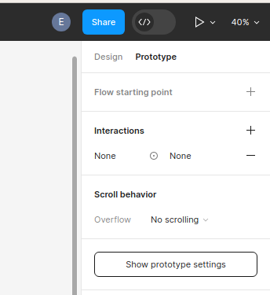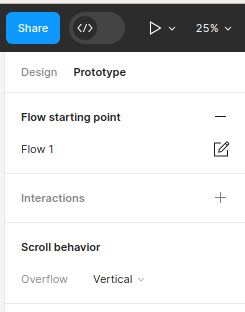

We can decide what scroll behaviour the frame should have from the drop down menu. While looking at this pannel we should add a low starting point. This allows us to share the flow with other users instead of the design file. Once other user opens the shared link they will be presented with the page which we marked as the flow starting point and will be able to view the design as if it is a functioning web page. 

We can now present the file by clicing on the play icon in the top right of the toolbar to view what we have created. Since we might not have the same size screen as we developed this platform to have we can re-size the presentation by pressing `Z` on the keyboard. This will resize the design to one of the following:

- Actual size
- Fill screen
- Fit to width
- Fit to screen

### Sharing the design
Inorder to share the design we can select the share button, which will open a small window in the middle of the screen. From here we can provide figma with the email addresses of people you would like to share the design with as well as select their level of access to the design file. We can give users edit or viewing rights.

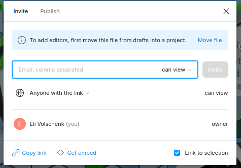

All users will be able to create comments directly on the design file with the comment tool. But only users with edit rights will be able to make any changes to your design file. 

