# Tutorial 1: Create a basic web page layout

In this tutorial you will learn how to create a basic web page desig which we can show off to clinets. It is best to start this tutorial after reviewing the short videos in the [fundamentals](../figma_basic/index.md) section. 

We will cover the following consepts:
- [Creating a basic layout]()
- [Creating a navbar]()
- [Creating buttons]()
- [Adding Images]()
- [Present and share the design]()

> **Note:** *You can use the link to skip to certain sections of this document.*

### Creating a basic layout
When you create a design it is important to considder the sise of your canvas. In Figma our canvas is called a `Frame`. A frame defines the basic size of the screen and allows us to present the design as if it is a fully working web page. Once all design elements have been created we can simply move them to the frame. To give us an idea of what our target audince might be using we can google for [the most common screen sizes](https://www.google.com/search?q=most+common+screen+sises&oq=most+common+screen+sises&aqs=chrome..69i57j0i13i512l3j0i22i30l6.5984j0j7&sourceid=chrome&ie=UTF-8). Armed with this information we can now start creating a design.

> **Note:** *At the time of writing this tutorial the mos common screen size was 1920x1080, and is what will be used in this tutorial.*

1. To start we can open a new blank canvas on figma. I'll create a place holder frame for our contnet
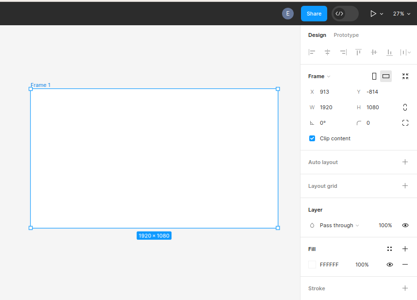

Let take a brief moment beofre we get worked up to considder what our web page should liik like. With almost all pages we have some key elements present. We have some form of navigation, some content and links to other web pages like social media or about pages. I went ahead and created a mind map of what our basic web page should look like using [Draw.io](https://app.diagrams.net/). this will give us some clarity on what we shoul considder to be important and what is not as important. 

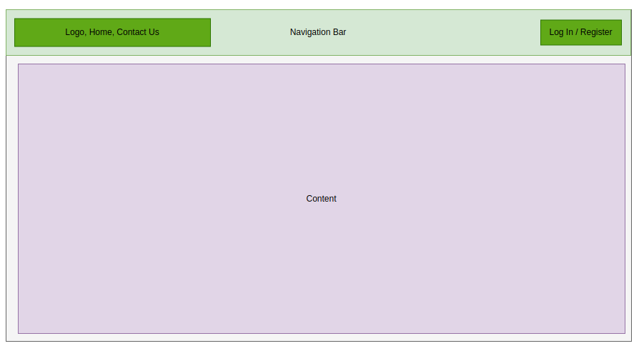

Armed wtih this knowlege we know we shoul account for at least 3 elements:
- Buttons
- Navbar
- Images - spesifically logo's

we should also account for adidtional pages:
- Login
- Register
- Contact Us

### Creating a navbar

In order to effectivly navigate the through the platfor we need to add a navbar. This does not need to be a complex thing and we will go for a normal option. In our navbar we would like to feature some itmes namely an icon, and a login or register button. Lets start by working on the navbar its self.

1. In Figma select the create rectangle tool or press `R` on your keyboard. Draw out a rectangle in an open area on your work area. 

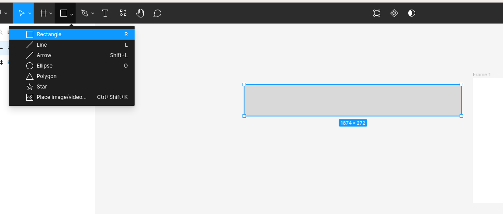

2. Now resise the rectangle to be the width of your selected screen size and about 50 high. THis should give us a decent sise nav bar to work with.

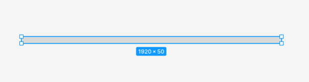 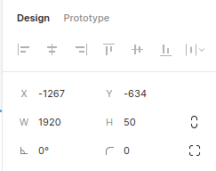

3. Now we can add some color to the navbar. I have decided I want to make my navbar green with a sligh gradient on it. Feel free to copy my design or select your own colors you like.

    We can change the color of the navbar by selecting the `+` icon next to stroke in the design and properties pannel. 

    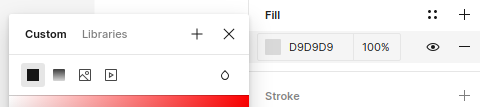

    switch to gradient by selecting the gradient logo

    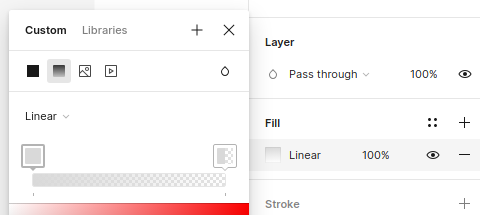

    we can now select our color we want to use. make sure to do this for both squares. Notice that the opacity of the second square is `0%`. bring this up to `100%` to have two solid colors. Now we can adjust the two colors to what we want. if you want to add more color to the gradient you can do so by double clicking on the squares. 

    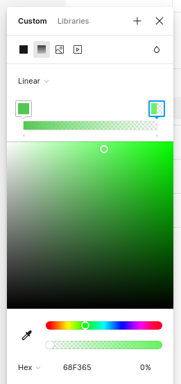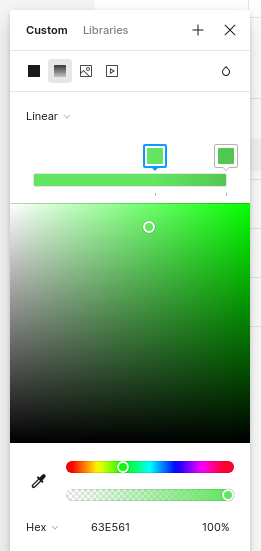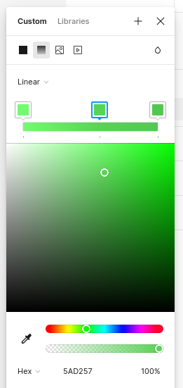

    Notice the gradient follow the gradient line guide on the selected rectangle.

    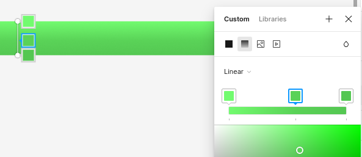