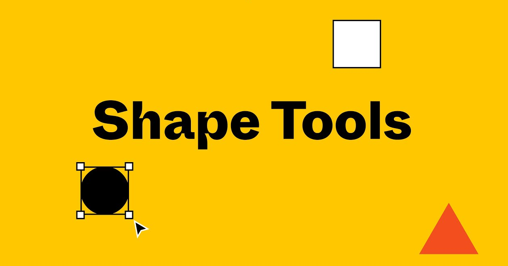
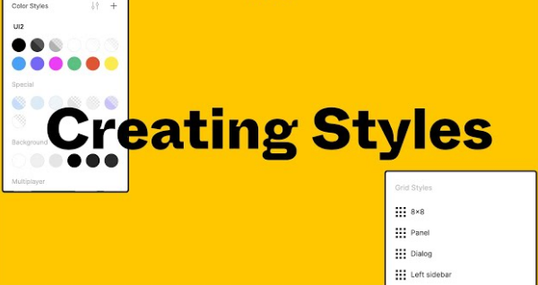
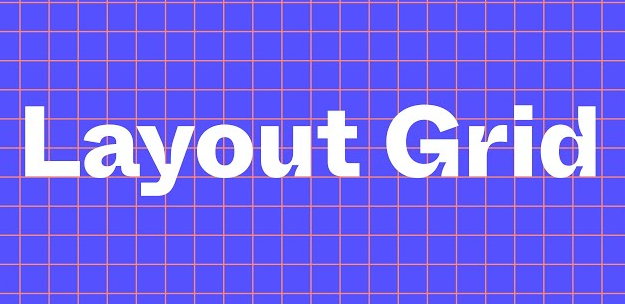
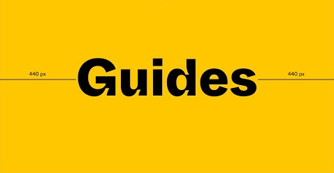
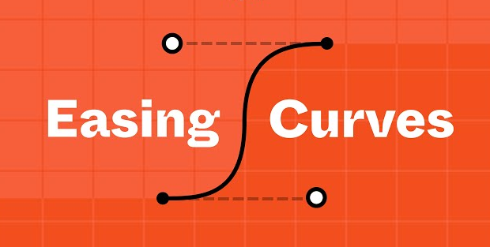
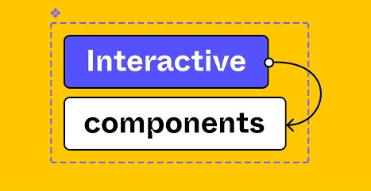

# Figma Fundamentals: A Quick Reference Guide
This collection of figma tools is designed to serve as quick reference guide for users to get a brief discription of the tool and its capabilities. Select a tool below to learn more about it.

|   |   |   |   |
| :---: | :----: | :----: | :----: |
|    [**Shape Tools**](../figma_basic/shapeTools.md) |    [**Pen Tools**](../figma_basic/penTool.md) |    [**Auto Layout**](../figma_basic/autoLayout.md) |    [**Constraints**](../figma_basic/constraints.md) |
|    [**Gradients**](../figma_basic/gradients.md) |    [**Effects**](../figma_basic/effects.md) |    [**Color Picker**](../figma_basic/colorPicker.md) |    [**Creating Styles**](../figma_basic/creatingStyles.md) |
|    [**Rounded Corners**](../figma_basic/roundedCorners.md) |    [**Text Tools and Fonts**](../figma_basic/textToolsAndFonts.md) |    [**Boolean Operations**](../figma_basic/booleanOperations.md) |    [**Images**](../figma_basic/images.md) |
|    [**Alignment and Distribution**](../figma_basic/aligmentAndDistribution.md) |    [**Layout Grids**](../figma_basic/gridLayout.md) |    [**Guides**](../figma_basic/guides.md) |    [**Easing Curves**](../figma_basic/erasingCurves.md) |
|    [**Variants**](../figma_basic/variants.md) |    [**Interactive Components**](../figma_basic/interactiveComponents.md) |    [**Masks**](../figma_basic/masks.md) |    [**Branching and Merging**](../figma_basic/branchingAndMerging.md) |
|    [**User Interface**](../figma_basic/userInterface.md) |   |   |   |
