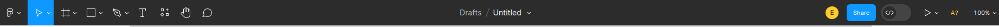
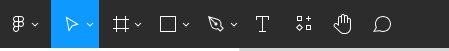
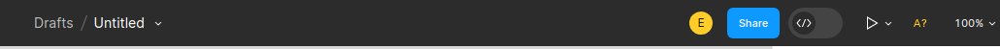
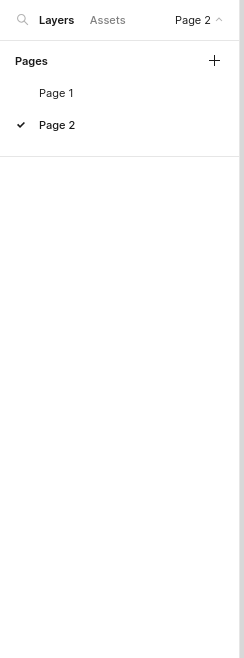
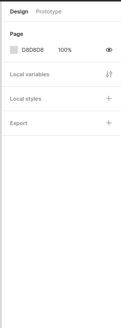

# Figma User Interface
The Figma user interface is broken up into 4 main components:

1. **The working area:** The working area is wwhere all the designs are put togeter and worked on.
2. **The toolbar:** The toolbar houses all the design tools to create new elements.

    
    Ths toolbar has two main areas. On the left of the toolbar all the figma design tools are grouped together.

    

    The right of the toolbar contains all the general information of the design file like the filename, as well as all other presenting and sharing options.

    

3. **The layers and assets pannel:** The layesr and assets pannel displays all elements currently in the working area in a cronologic manner.

    

4. **The design an properties pannel:** With the design and properties pannel we can alter the color and effects of element and is also th main prototyping pannel used to make designs interactive.

    

