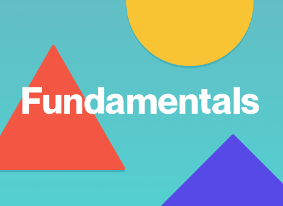

<!-- add nav menu here -->
###### [Figma]() | [Back]()

# What is Figma?
Figma is a collaborative web application for interface design, with additional offline features enabled by desktop applications for macOS and Windows. Figam can be used online by visiting [www.figma.com](http://www.figma.com) and creating an free account. The feature set of Figma focuses on user interface and user experience design, with an emphasis on real-time collaboration, utilising a variety of vector graphics editor and prototyping tools. 

Designs can be shared effortlessly with various different sharing options alowing colaborative feedback direcltly on the design interface.
The Figma mobile app for Android and iOS allows viewing and interacting with Figma prototypes in real-time on mobile and tablet devices.

### Using Figma
Using Figma to create interactive and creative designs is free by simply navigating to [www.figma.com](http://wwww.figma.com) and creating an account. Follow along with the tutorials laid out in the following section to lrean how to use Figma to create beautiful interactive user interfaces. For firstime users please review the figma fundamantals learn the basics of figma tools, where to find them and how to use them.

|   |   |
| :---: | :--- |
| [  [**Figma Fundamentals**](./figma_basic/index.md)| Learn the basics of figma tools and where to find them. |
| [  [**Platform Design**](./firstProject/index.md) | Create a beautiful interactive platform with animations. |
| [  [**Advanced Prototyping**](./firstProject/index.md) | Create stunning complex visua animations with an interactive map. |